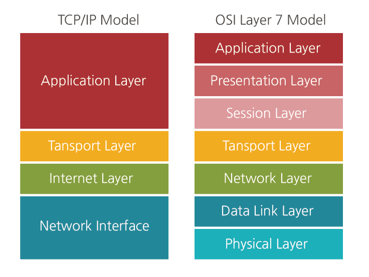

## TIL

[모두의 네트워크](http://www.kyobobook.co.kr/product/detailViewKor.laf?mallGb=KOR&ejkGb=KOR&barcode=9791160505030)를 읽고 요약 및 정리한 글 입니다.

## 2장: 네트워크의 기본 규칙

### 06 네트워크의 규칙

일상생활에서도 지켜야 하는 규칙이 있듯이, 네트워크에서도 문제없이 통신하려면 **규칙(약속)**을 지켜야 한다. 그리고 이와 같은 규칙을 **프로토콜(protocol)**이라고 한다.

### 07 OSI 모델과 TCP/IP 모델

옛날에는 같은 회사의 컴퓨터끼리만 통신이 가능했던 시절이 있었다. 즉, A 사의 컴퓨터가 B 사의 컴퓨터와 통신을 못하는 것이다. 이렇듯이 표준이 정의되지 않을 경우 많은 불편함이 발생할 수 있다. 이러한 불편함을 해소하기 위해 ISO(International Organization for Standardization, 국제표준화기구)는 **OSI 모델**이라는 표준 규격을 제정했다.

OSI 모델은 네트워크 기술의 기본이 되는 모델이다. 데이터의 송·수신은 컴퓨터에서 컴퓨터로 데이터를 전송하는데, 이때 컴퓨터 내부에서는 여러 가지 일이 발생한다. 그리고 그 일을 <u>일곱 개 계층</u>으로 나눠서 한다. 그 일곱 개 계층이 아래와 같은 OSI 모델이다.

통신을 할 때는 맨 위의 응용계층에서 순차적으로 아래 계층으로 전달된다.

| 계층  |               이름                |                                     설명                                     |
| :---: | :-------------------------------: | :--------------------------------------------------------------------------: |
| 7계층 |   응용 계층(Application Layer)    | 이메일 & 파일 전송, 웹 사이트 조회 등 애플리케이션에 대한 서비스를 제공한다. |
| 6계층 |   표현 계층(Presentation Layer)   |               문자 코드, 압축, 암호화 등의 데이터를 변환한다.                |
| 5계층 |     세션 계층(Session Layer)      |                       세션 체결, 통신 방식을 결정한다.                       |
| 4계층 |    전송 계층(Transport Layer)     |                       신뢰할 수 있는 통신을 구현한다.                        |
| 3계층 |   네트워크 계층(Network Layer)    |       다른 네트워크와 통신하기 위한 경로 설정 및 논리 주소를 결정한다.       |
| 2계층 | 데이터 링크 계층(Data Link Layer) |           네트워크 기기 간의 데이터 전송 및 물리 주소를 결정한다.            |
| 1계층 |     물리 계층(Physical Layer)     |          시스템 간의 물리적인 연결과 전기 신호를 변환 및 제어한다.           |

데이터를 전송하는 쪽은 데이터를 보내기 위해서 상위 계층에서 하위 계층으로 데이터를 전달한다. <u>각 계층은 독립적이므로 데이터가 전달되는 동안에 다른 계층의 영향을 받지 않는다.</u>그리고 데이터를 받는 쪽은 하위 계층에서 상위 계층으로 각 계층을 통해 전달된 데이터를 받게 된다.

---

위에서 언급한 내용은 OSI 7계층 모델이다. 7계층을 4계층으로 바꾼 모델을 **TCP/IP 모델**이라고 한다. 위의 이미지의 왼쪽에 있는 모델이 TCP/IP 모델이다. TCP/IP 모델은 OSI 모델에서 여러 계층을 통합해서 4개의 계층으로 표현한다.

그리고 각각의 계층에는 다양한 프로토콜이 있다.

### 08 캡슐화와 역캡슐화

앞써 설명했듯이 컴퓨터 A(송신 측)에서 컴퓨터 B(수신 측)으로 데이터를 보내기 위해서는 상위 계층에서 하위 계층으로 데이터를 전달해야 한다. 이 때 데이터의 앞부분에 전송하는 데 필요한 정보를 붙여서 다음 계층으로 보내게 된다. 이 때 데이터의 앞부분에 붙는 정보를 **헤더(header)**라고 한다. 이 헤더에는 **데이터를 전달받을 상대방에 대한 정보**도 포함되어 있다. 그리고 이렇게 헤더를 붙여 나가는 것을 **캡슐화**라고 한다. 반대로 데이터를 받는(수신 측)에서는 원래 데이터를 얻기 위해서 하위 계층에서 상위 계층으로 데이터를 전달하며 헤더를 하나씩 제거한다. 이것을 **역캡슐화**라고 한다.

### 용어 정리

- 프로토콜(protocol): 컴퓨터 간에 정보를 주고 받을 때의 통신 방법에 대한 규칙이나 표준
- OSI 모델(Open Standards Interconnection model): 국제표준화기구(ISO)가 1977년에 정의한 국제 통신 표준 규약이다. 네트워크의 기본 구조를 일곱 개 계층으로 나눠서 표준화한 통신 규약으로 현재 다른 모든 통신 규약의 기반이 된다.
- TCP/IP 모델(Transmission Control Protocol/Internet Protocol model): OSI 모델 7계층의 네트워크에서 데이터를 전송하는 과정을 네 개 계층(Layer)으로 단순화시켜 사용하는 모델이다. 인터넷 모델이라고도 한다.
- 캡슐화/역캡슐화(encapsulation/decapsulation): 캡슐화는 컴퓨터 통신에서 상위 계층의 통신 프로토콜 정보를 데이터에 추가하여 하위 계층으로 전송하는 기술이다. 반대로 역캡슐화는 상위 계층의 통신 프로토콜에서 하위 계층에서 추가한 정보와 데이터를 분리하는 기술이다.
- 헤더(header): 저장되거나 전송되는 데이터의 맨 앞에 위치하는 추가적인 정보 데이터다. 데이터의 내용이나 성격을 식별 또는 제어하는 데 사용된다.
